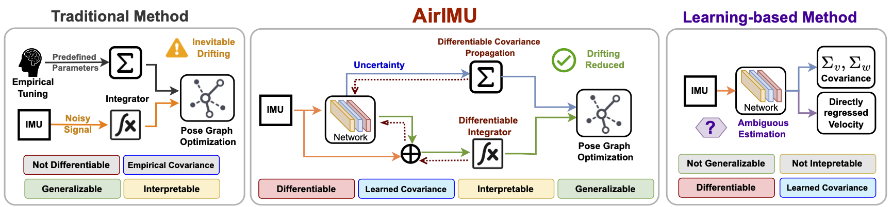

# AirIMU : Learning Uncertainty Propagation for Inertial Odometry
[](./LICENSE)
[](https://airimu.github.io/)
[](https://www.youtube.com/watch?v=fTX1u-e7wtU)
[](https://arxiv.org/abs/2310.04874)




## Installation

This work is based on pypose. Follow the instruction and install the newest realase of pypose:
https://github.com/pypose/pypose


## Dataset
> **Note**: Remember to reset the `data_root` in `configs/datasets/${DATASET}/${DATASET}.conf`.

Download the Euroc dataset from:
https://projects.asl.ethz.ch/datasets/doku.php?id=kmavvisualinertialdatasets

Download the TUM VI dataset from:
https://cvg.cit.tum.de/data/datasets/visual-inertial-dataset

Download the KITTI dataset from:
https://www.cvlibs.net/datasets/kitti/

## Train

Easy way to start the training using the exisiting configuration.
> **Note**:You can also create your own configuration file for different datasets and set the parameters accordingly.

```
python train.py --config configs/exp/EuRoC/codenet.conf

```

More specific option:

```
usage: train.py [-h] [--config CONFIG] [--device DEVICE] [--load_ckpt] [--log]

optional arguments:
  -h, --help       show this help message and exit
  --config CONFIG  config file path
  --device DEVICE  cuda or cpu, Default is cuda:0
  --load_ckpt      If True, try to load the newest.ckpt in the exp_dir specificed in our config file.
  --log            if True, save the meta data with wandb, Default is True
```

## Evaluation

To evaluate the model and generate network inference file net_output.pickle, run the following command:
```
python inference.py --config configs/exp/EuRoC/codenet.conf

```

<br>

You can use the evaluation tool to assess your model performance with net_output.pickle， run the following command.
> **Note**: Make sure to replace path/to/net_output_directory with the directory path where your network output pickle file is stored.

```
python evaluation/evaluate_state.py --dataconf configs/datasets/${DATASET}/${DATASET}.conf --exp path/to/net_output_directory

```

<br>
More specific option for the evaluation tool:

```
usage: evaluation/evaluate_state.py [-h] [--dataconf] [--device] [--exp] [--seqlen] [--savedir] [--usegtrot] [--mask]

optional arguments:
  -h, --help       show this help message and exit
  --config         config file path
  --device         cuda or cpu, Default is cuda:0
  --exp            the directory path where your network output pickle file is stored
  --seqlen         the length of the integration sequence
  --savedir        the save diretory for the evaluation results, default path is  "./result/loss_result"
  --usegtrot       use ground truth rotation for gravity compensation, default is true
  --mask           mask the segments if needed. 
```


### Cite Our Work

Thanks for using our work. You can cite it as:

```bib
@article{qiu2023airimu,
            title={AirIMU: Learning Uncertainty Propagation for Inertial Odometry}, 
            author={Yuheng Qiu and Chen Wang and Xunfei Zhou and Youjie Xia and Sebastian Scherer},
            year={2023},
            eprint={2310.04874},
            archivePrefix={arXiv},
            primaryClass={cs.RO}
      }
```
